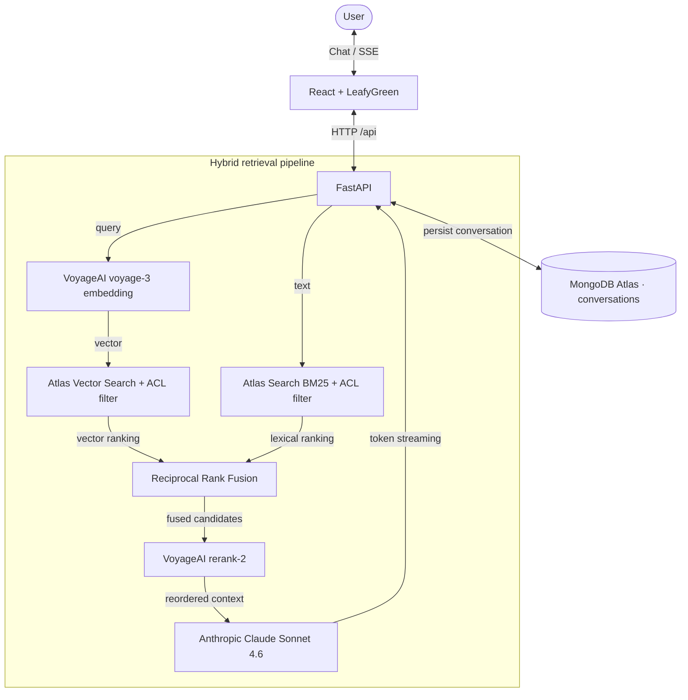

# RAG Assistant — MongoDB Atlas Vector Search

A retrieval-augmented generation (RAG) assistant for querying corporate documents
in natural language. This proof of concept runs entirely on MongoDB Atlas: it
combines vector and lexical search, re-ranks the candidates, and streams answers
from Claude. The reference deployment answers questions about the TJGO PDTIC
2025–2027 plan, but the stack is document- and tenant-agnostic.

> Each tenant runs against its own MongoDB Atlas database, configured entirely
> through environment variables.

## Architecture



### Request flow

| Step | Component | Description |
|------|-----------|-------------|
| 1 | Ingestion | Document (PDF/DOCX/TXT/CSV) is split into chunks, embedded with `voyage-3`, and stored in Atlas with an access-level tag |
| 2 | Hybrid search | The query runs vector (ANN) and lexical (BM25) search in parallel, each filtered by access level |
| 3 | Fusion | The two rankings are merged with Reciprocal Rank Fusion (RRF) |
| 4 | Re-ranking | `rerank-2` reorders the fused candidates; the top 8 are kept |
| 5 | Generation | The selected context and session history are sent to Claude Sonnet 4.6 with SSE streaming |
| 6 | Persistence | The conversation is stored in the `conversations` collection and can be resumed by thread ID |

## Features

- **Hybrid search** — vector (`$vectorSearch`) and lexical (Atlas Search / BM25) fused with RRF
- **Re-ranking** — VoyageAI `rerank-2` reorders candidates before they reach the model
- **Access control** — `nivel_acesso` filter (public / restricted) applied on both search stages
- **Streaming** — token-by-token answers over Server-Sent Events
- **Persistent memory** — conversations stored in MongoDB and resumable by thread ID
- **Multi-format ingestion** — PDF, DOCX, TXT, CSV
- **Multi-tenant** — one Atlas database per tenant, configured through `.env`
- **Configurable prompts** — starter questions and follow-ups per tenant via `client_config.json`
- **Export** — conversations exportable to TXT or JSON

> This is a proof of concept. The access level is selected in the UI for
> demonstration purposes. In production it would be derived from authentication
> (SSO / JWT), never sent by the client.

## Stack

| Layer | Technology |
|-------|------------|
| Frontend | React + Vite + LeafyGreen (MongoDB design system) |
| API | FastAPI (SSE streaming) |
| Database / vector store | MongoDB Atlas (Vector Search + Atlas Search) |
| Embeddings & re-ranker | VoyageAI (`voyage-3`, `rerank-2`) |
| LLM | Anthropic Claude Sonnet 4.6 (`claude-sonnet-4-6`) |
| Orchestration | LangGraph |
| Document loading | LangChain community loaders |

## Getting started

### 1. Clone and create a virtual environment

```bash
git clone https://github.com/adrianofratelli-glitch/MongoDB-RAG.git
cd MongoDB-RAG
python3 -m venv .venv
source .venv/bin/activate   # Windows: .venv\Scripts\activate
pip install -r requirements.txt
```

### 2. Environment variables

Copy `.env.example` to `.env` and fill in the values:

```bash
cp .env.example .env
```

```env
MONGO_URI="your_atlas_connection_string"
VOYAGE_API_KEY="your_voyage_key"
ANTHROPIC_API_KEY="your_anthropic_key"

CLIENT_ID="tenant_id"             # used to name the database: rag_<CLIENT_ID>
CLIENT_NAME="Tenant Name"
DOCUMENT_TITLE="Document Title"
DOCUMENT_DESCRIPTION="Description shown in the interface."
```

### 3. Provision MongoDB Atlas

`setup_db.py` creates the collections and both search indexes — the vector index
(`vector_index`, with the access-level filter) and the lexical index
(`text_index`) used by hybrid search:

```bash
python setup_db.py
```

> Atlas search indexes take about a minute to become queryable after creation.

### 4. Ingest a document

```bash
# PDF, DOCX, TXT, or CSV
python ingest.py path/to/document.pdf

# Re-index a document that is already stored
python ingest.py path/to/document.pdf --reset

# Ingest as restricted content (access-control demo)
python ingest.py path/to/restricted-annex.pdf --nivel restrito
```

> The VoyageAI free tier is limited to 3 requests per minute, so the script
> embeds in small batches with a 22-second pause between them.

### 5. Configure starter questions (optional)

```bash
cp client_config.example.json client_config.json
```

### 6. Run

The helper script starts both services:

```bash
./run.sh
```

Or run them separately:

```bash
# Backend (FastAPI)
uvicorn backend.api:app --reload --port 8180

# Frontend (React + LeafyGreen)
cd frontend
npm install        # first run only
npm run dev        # served at http://localhost:5180, proxies /api to :8180
```

Open **http://localhost:5180**. The frontend proxies `/api` to the backend, so
there is no CORS configuration to manage in development.

## Project layout

```
.
├── backend/
│   └── api.py                 # FastAPI app (config / status / chat SSE)
├── frontend/                  # React + Vite + LeafyGreen client
│   └── src/
│       ├── App.jsx            # State and orchestration
│       ├── api.js             # config/status calls + SSE chat stream
│       └── components/        # Sidebar, TopBar, KpiRow, ChatMessage, EngineStrip, Sources, ...
├── agent.py                   # retrieve_context: hybrid search + RRF + re-rank, with ACL
├── ingest.py                  # Multi-format ingestion (--nivel sets the access level)
├── setup_db.py                # Creates collections and indexes (vector_index + text_index)
├── config.py                  # Central configuration from environment variables
├── db.py                      # Shared MongoDB client (connection pool)
├── client_config.json         # Per-tenant questions/follow-ups (not committed)
├── client_config.example.json # Example tenant configuration
├── requirements.txt
├── .env.example
├── data/                      # Tenant documents (not committed)
└── assets/                    # Tenant visual assets (not committed)
```

## Adding a tenant

1. Set the tenant values in `.env`.
2. Place the document under `data/`.
3. Copy `client_config.example.json` to `client_config.json` and customize it.
4. Run `python setup_db.py`, then `python ingest.py data/document.pdf`, then start
   the backend and frontend.

Each tenant uses an isolated MongoDB database (`rag_<CLIENT_ID>`), so projects do
not interfere with one another.

## Environment variables

| Variable | Required | Description |
|----------|----------|-------------|
| `MONGO_URI` | yes | MongoDB Atlas connection string |
| `VOYAGE_API_KEY` | yes | VoyageAI API key |
| `ANTHROPIC_API_KEY` | yes | Anthropic API key |
| `CLIENT_ID` | yes | Tenant identifier (defines the database name) |
| `CLIENT_NAME` | yes | Name shown in the interface |
| `DOCUMENT_TITLE` | yes | Document title |
| `DOCUMENT_DESCRIPTION` | no | Description shown in the header |
| `DB_NAME` | no | Database name (defaults to `rag_<CLIENT_ID>`) |
| `SYSTEM_PROMPT_EXTRA` | no | Extra instruction appended to the system prompt |
