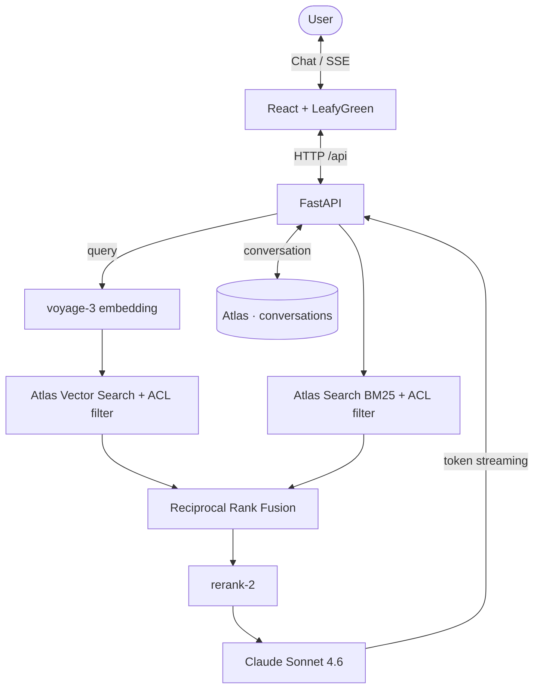

# RAG Assistant — MongoDB Atlas Vector Search

Ask a 200-page planning document a question in plain language and get a cited answer in seconds. Vector and lexical search run in parallel on Atlas, RRF fuses the rankings, a re-ranker picks the best passages, and Claude answers using only those — streamed token by token.

Tenant-agnostic by design: no client name, document or branding lives in the repo. A new tenant is a `.env`, a PDF and one JSON file.

## The demo in 4 steps

**1. Pick an access profile and a question.** The profile (public / restricted) is the ACL filter applied to *both* search stages, default-deny.


**2. Ask.** The query is embedded with `voyage-3` and runs `$vectorSearch` and Atlas Search (BM25) in parallel, each already filtered by access level.

**3. Watch the pipeline report itself.** RRF fuses the two rankings, `rerank-2` reorders, the top 8 chunks become the context — and the UI shows which stage produced what.


**4. Check the sources.** Every answer carries the passages and pages it came from, so it can be verified instead of trusted.


> Screenshots run against a live tenant; the organization and document names are replaced with neutral ones.

## How a question is answered



If one of the two indexes fails, the other carries the query. The stable instruction block (including a document outline) is cached by the Anthropic API, so repeat turns cost less. Conversations persist in MongoDB and resume by thread ID.

Ingestion accepts PDF, DOCX, TXT, CSV, Markdown, HTML, JSON, XLSX and PPTX.

> Proof of concept: the access level is picked in the UI for demonstration. In production it would come from authentication (SSO / JWT), never from the client.

## Run it

```bash
python3 -m venv .venv && source .venv/bin/activate
pip install -r requirements.txt
cp .env.example .env          # keys + tenant values
python setup_db.py            # collections + vector_index + text_index
python ingest.py data/document.pdf
cp client_config.example.json client_config.json   # starter questions (optional)
./run.sh                      # backend :8180, frontend :5180
```

```env
MONGO_URI=
VOYAGE_API_KEY=
ANTHROPIC_API_KEY=
CLIENT_ID=tenant_id           # database becomes rag_<CLIENT_ID>
CLIENT_NAME=Tenant Name
DOCUMENT_TITLE=Document Title
DOCUMENT_DESCRIPTION=Shown in the header
```

Atlas search indexes take about a minute to become queryable. Ingest restricted content with `--nivel restrito`, re-index with `--reset`. The VoyageAI free tier allows 3 requests/minute, so ingestion embeds in small batches with a pause (`VOYAGE_SLEEP_S`) and inserts each batch as it goes, so an interruption doesn't lose progress.

Optional: `DB_NAME`, `SYSTEM_PROMPT_EXTRA`, `ALLOWED_ORIGINS`.

Tests: `python -m unittest discover -s tests -v` — pure logic, no live services.

## Adding a tenant

Set the tenant values in `.env`, drop the document in `data/`, customize `client_config.json`, then `setup_db.py` → `ingest.py` → `run.sh`. Each tenant gets its own database (`rag_<CLIENT_ID>`). `data/`, `assets/` and `client_config.json` are gitignored — nothing tenant-specific reaches the repository.

## Layout

```
backend/api.py     FastAPI app (config / status / chat SSE / metrics)
frontend/          React + Vite + LeafyGreen
agent.py           hybrid search + RRF + re-rank, with ACL
ingest.py          multi-format ingestion (--nivel sets access level)
setup_db.py        collections and both search indexes
config.py db.py    configuration and shared Mongo client
observability.py   structured logging + /api/metrics
```

## Stack

React + Vite + LeafyGreen · FastAPI (SSE) · MongoDB Atlas Vector Search + Atlas Search · VoyageAI `voyage-3` / `rerank-2` · Claude Sonnet 4.6 · LangChain community loaders.
