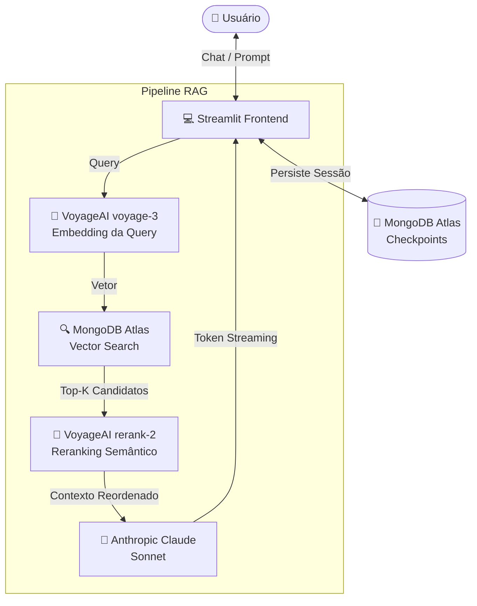

# Enterprise RAG Assistant 🧠

Boilerplate de **RAG (Retrieval-Augmented Generation) corporativo** com busca semântica avançada, reranking e memória persistente. Projetado para ser configurado rapidamente para qualquer cliente e qualquer tipo de documento.

> **Multi-cliente:** cada cliente usa seu próprio banco no MongoDB Atlas, configurado via variáveis de ambiente — sem tocar no código.

---

## 🏗️ Arquitetura



### Fluxo detalhado

| Etapa | Componente | Descrição |
|-------|-----------|-----------|
| 1 | **Ingestão** | Documento (PDF/DOCX/TXT/CSV) → chunks → embeddings via `voyage-3` → Atlas |
| 2 | **Query** | Pergunta do usuário → embedding → Vector Search (ANN) no Atlas |
| 3 | **Reranking** | Top-K candidatos reordenados pelo `rerank-2` → apenas os 8 mais relevantes passam |
| 4 | **Geração** | Contexto limpo + histórico da sessão → Claude Sonnet com streaming |
| 5 | **Persistência** | Checkpoints de sessão salvos no MongoDB para retomada futura |

---

## ✨ Funcionalidades

- **Busca Semântica** — MongoDB Atlas Vector Search com embeddings `voyage-3`
- **Reranking** — `rerank-2` da VoyageAI filtra e reordena candidatos antes do LLM
- **Streaming** — respostas em tempo real token a token via Claude Sonnet
- **Memória de Sessão** — histórico de conversa persistido no MongoDB (LangGraph Checkpointer)
- **Multi-formato** — ingestão de `.pdf`, `.docx`, `.txt`, `.csv`
- **Multi-cliente** — cada cliente tem seu próprio banco, configurado via `.env`
- **Perguntas personalizadas** — sugestões e follow-ups configuráveis por `client_config.json`
- **Export** — conversa exportável em TXT ou JSON

---

## 🛠️ Stack

| Camada | Tecnologia |
|--------|-----------|
| Interface | React + Vite + **LeafyGreen** (design system oficial MongoDB) |
| API | FastAPI (streaming SSE) |
| Banco / Vector Store | MongoDB Atlas |
| Embeddings & Reranker | VoyageAI (`voyage-3`, `rerank-2`) |
| LLM | Anthropic Claude Sonnet |
| Orquestração | LangGraph |
| Carregamento de docs | LangChain Community Loaders |

---

## 🚀 Setup

### 1. Clone e ambiente virtual

```bash
git clone https://github.com/adrianofratelli-glitch/MongoDB-RAG.git
cd MongoDB-RAG
python3 -m venv .venv
source .venv/bin/activate   # Windows: .venv\Scripts\activate
pip install -r requirements.txt
```

### 2. Variáveis de ambiente

Copie `.env.example` para `.env` e preencha:

```bash
cp .env.example .env
```

```env
MONGO_URI="sua_connection_string_atlas"
VOYAGE_API_KEY="sua_chave_voyage"
ANTHROPIC_API_KEY="sua_chave_anthropic"

CLIENT_ID="nome_cliente"          # usado para nomear o banco: rag_<CLIENT_ID>
CLIENT_NAME="Nome do Cliente"
DOCUMENT_TITLE="Nome do Documento"
DOCUMENT_DESCRIPTION="Descrição exibida na interface."
```

### 3. Configure o MongoDB Atlas

Execute o script de setup para criar collections e índices:

```bash
python setup_db.py
```

Em seguida, crie o índice vetorial no Atlas UI:
- Collection: `documents`
- Campo: `embedding` | Dimensões: `1024` | Similaridade: `cosine`
- Nome do índice: `vector_index`

### 4. Ingira o documento

```bash
# PDF, DOCX, TXT ou CSV
python ingest.py caminho/para/documento.pdf

# Para reindexar um documento já existente
python ingest.py caminho/para/documento.pdf --reset
```

> **Free tier VoyageAI:** o script usa batches conservadores com pausa de 22s entre eles para respeitar o limite de 3 RPM.

### 5. Personalize perguntas (opcional)

Copie e edite o arquivo de configuração do cliente:

```bash
cp client_config.example.json client_config.json
```

### 6. Inicie a aplicação (2 processos)

**Backend (API FastAPI):**

```bash
uvicorn backend.api:app --reload --port 8000
```

**Frontend (React + LeafyGreen):**

```bash
cd frontend
npm install        # primeira vez
npm run dev        # abre em http://localhost:5173 (proxy /api -> :8000)
```

Abra **http://localhost:5173**. O frontend faz proxy de `/api` para o backend, sem CORS.

---

## 📁 Estrutura

```
.
├── backend/
│   └── api.py                 # API FastAPI (config / status / chat SSE)
├── frontend/                  # App React + Vite + LeafyGreen (UI oficial MongoDB)
│   └── src/
│       ├── App.jsx            # Orquestração + estado
│       ├── api.js             # axios (config/status) + fetch SSE (chat)
│       └── components/        # Sidebar, TopBar, KpiRow, ChatMessage, EngineStrip, Sources, ...
├── agent.py                   # retrieve_context (Vector Search + rerank) — reaproveitado
├── ingest.py                  # Ingestão multi-formato
├── setup_db.py                # Setup de collections e índices
├── config.py                  # Configuração central via env vars
├── client_config.json         # Perguntas/followups por cliente (não versionado)
├── client_config.example.json # Exemplo de configuração de cliente
├── requirements.txt
├── .env.example
├── data/                      # Documentos do cliente (não versionados)
└── assets/                    # Assets visuais do cliente (não versionados)
```

---

## ⚙️ Adicionando um novo cliente

1. Configure `.env` com os dados do novo cliente
2. Coloque o documento em `data/`
3. Copie `client_config.example.json` → `client_config.json` e personalize
4. `python setup_db.py` → `python ingest.py data/documento.pdf` → `uvicorn backend.api:app --port 8000` + `cd frontend && npm run dev`

Cada cliente usa um banco MongoDB isolado (`rag_<CLIENT_ID>`), sem interferência entre projetos.

---

## 🔑 Variáveis de ambiente — referência completa

| Variável | Obrigatória | Descrição |
|----------|-------------|-----------|
| `MONGO_URI` | ✅ | Connection string do MongoDB Atlas |
| `VOYAGE_API_KEY` | ✅ | Chave da API VoyageAI |
| `ANTHROPIC_API_KEY` | ✅ | Chave da API Anthropic |
| `CLIENT_ID` | ✅ | ID do cliente (define nome do banco) |
| `CLIENT_NAME` | ✅ | Nome exibido na interface |
| `DOCUMENT_TITLE` | ✅ | Título do documento |
| `DOCUMENT_DESCRIPTION` | — | Descrição exibida no header |
| `DB_NAME` | — | Nome do banco (padrão: `rag_<CLIENT_ID>`) |
| `SYSTEM_PROMPT_EXTRA` | — | Instrução extra para o system prompt |
