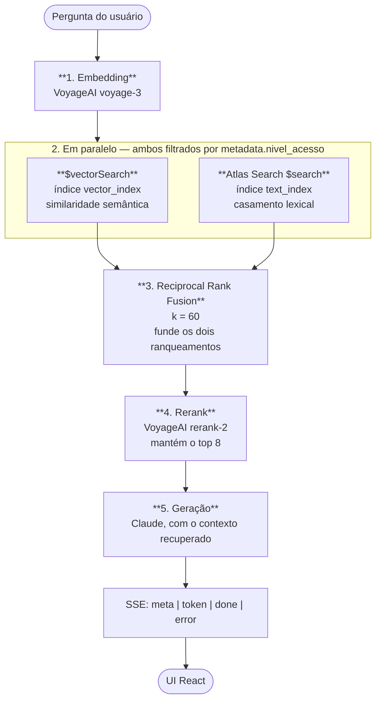
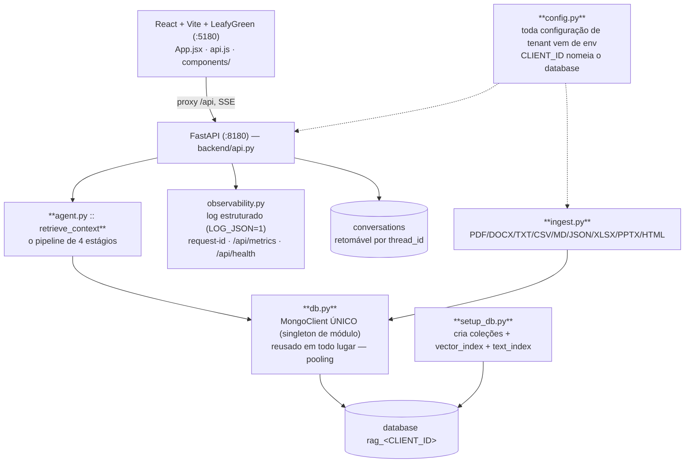

# RAG sobre MongoDB Atlas Vector Search — Assistente Documental Multi-tenant

PoC de assistente RAG sobre MongoDB Atlas Vector Search. O deployment de referência responde perguntas sobre um documento público de planejamento de TI do setor público (PDTIC do TJGO), mas **a stack é agnóstica de documento e de tenant** — cada tenant roda contra o próprio database Atlas, configurado inteiramente por `.env`.

Adicionar um tenant novo é: valores novos no `.env`, o documento em `data/`, e um `client_config.json`. **Zero mudança de código.**

---

## 1. O pipeline de recuperação

O ponto técnico do PoC não é "fazer RAG". É a qualidade da recuperação: **híbrido com fusão e reranking**, não similaridade vetorial pura.



Por que os quatro estágios em vez de só `$vectorSearch`:

- **Vetorial sozinho** erra em sigla, número de norma, nome próprio — coisas que documento de planejamento público tem aos montes.
- **Lexical sozinho** erra quando o usuário pergunta com outras palavras.
- **RRF** combina os dois ranqueamentos sem precisar normalizar scores de escalas diferentes (que, como se vê em outros PoVs, nem são comparáveis).
- **Rerank** é o que separa "8 chunks que casaram" de "os 8 chunks que respondem". É o estágio que mais melhora a resposta final por token gasto.

---

## 2. Arquitetura



`backend/api.py` **não usa** o `agent.build_graph()`. Ele chama `retrieve_context()` direto e constrói `SystemMessage`/`HumanMessage`/`AIMessage` na mão — **não** por `ChatPromptTemplate`. O motivo é concreto: o contexto recuperado do PDF ou o histórico podem conter chaves `{}` literais, que um template interpretaria como variável e quebraria.

O `build_graph()` do LangGraph (nós retrieve → generate, com checkpoint `MongoDBSaver`) existe e funciona, mas não está no caminho da API.

---

## 3. Ingestão

`ingest.py` é um loader multi-formato:

- PDF, DOCX, TXT, CSV, HTML via loaders da comunidade LangChain.
- Markdown, JSON, XLSX (openpyxl) e PPTX (python-pptx) via loaders leves próprios — escritos para **evitar a dependência pesada do `unstructured`**.

Chunking com `RecursiveCharacterTextSplitter`, 800 caracteres com 150 de overlap.

Embedding em lotes pequenos com **pausa de 22s** entre eles: o tier gratuito da VoyageAI limita a 3 requisições por minuto. Cada chunk é etiquetado com `nivel_acesso`.

```bash
python setup_db.py                                    # coleções + vector_index + text_index
python ingest.py caminho/documento.pdf                # ingestão
python ingest.py caminho/documento.pdf --reset        # reindexa documento existente
python ingest.py caminho/anexo.pdf --nivel restrito   # ingere como conteúdo restrito
```

---

## 4. Controle de acesso (`nivel_acesso`)

Conceito **só do PoC**: `"publico"` ou `"restrito"`, escolhido no lado do cliente na UI.

Filtrado nos **dois** estágios de busca — vetorial e lexical. Isso é o correto arquiteturalmente: filtrar só depois da fusão deixaria conteúdo restrito influenciar o ranqueamento antes de ser descartado.

**Em produção isso tem que vir de autenticação real (SSO/JWT), nunca de input do cliente.** Está documentado como limitação, não como feature.

---

## 5. Multi-tenancy

Um database Atlas por tenant: `rag_<CLIENT_ID>`.

Toda configuração vem de env, lida por `config.py`:

| Variável | Papel |
|---|---|
| `CLIENT_ID` | Identifica o tenant **e nomeia o database** (`rag_<CLIENT_ID>`) |
| `CLIENT_NAME` | Nome exibido |
| `DOCUMENT_TITLE` | Título do documento na UI |
| `DOCUMENT_DESCRIPTION` | Descrição |
| `SYSTEM_PROMPT_EXTRA` | Instruções extras de domínio no system prompt |

Perguntas iniciais e follow-ups vêm de `client_config.json` (gitignored; copiar de `client_config.example.json`), com defaults pt-BR hardcoded.

**Adicionar tenant = `.env` novo + documento em `data/` + `client_config.json`. Nenhuma linha de código.**

---

## 6. Conexão ao banco

`db.py` expõe um **`MongoClient` único, singleton de módulo**, reusado em todo lugar para aproveitar o pool de conexões. `ingest.py` e `backend/api.py` reusam o mesmo.

**Nunca instanciar `MongoClient` novo por requisição.** `setup_db.py` abre o próprio (script administrativo one-shot) e fecha na saída.

---

## 7. Conversas

Persistidas na coleção `conversations` do database do tenant, retomáveis por `thread_id` (`GET /api/history/{thread_id}`).

Falha de persistência é **engolida** (`_save_conversation`/`_load_conversation`) de propósito: um soluço do banco não pode derrubar o chat. Perder o histórico é aceitável; perder a conversa em andamento não é.

---

## 8. Exposição da API e segurança

- `ALLOWED_ORIGINS` (separado por vírgula) restringe quais origens chamam a API. Default: só o dev server local do Vite.
- `/api/chat` valida que a pergunta é não-vazia e menor que `MAX_QUESTION_LENGTH` (4000 caracteres) **antes de gastar uma chamada de LLM com ela**.

### O que ainda não tem, e está documentado

- **Não há autenticação em nenhum endpoint.**
- `access_level` é confiado do corpo da requisição.
- `/api/history/{thread_id}` devolve qualquer conversa para quem souber ou adivinhar o `thread_id` (um UUIDv4 gerado no cliente).

**Colocar autenticação real (SSO/JWT) antes de qualquer deployment que não seja demo.**

---

## 9. Frontend

O ponto do PoC é o pipeline de recuperação. Mas ninguém aprova um pipeline olhando log — a tela é onde o híbrido, o rerank e o controle de acesso viram argumento. A regra: **a UI não decide nada de recuperação**. Ela mostra o que o backend já resolveu.

### 9.1 Stack

| Item | Escolha | Motivo |
|---|---|---|
| Build | Vite, porta `5180` com `strictPort` | 5173 já está ocupada por outras POCs nesta máquina; falhar alto é melhor que trocar de porta em silêncio |
| UI kit | LeafyGreen (`@leafygreen-ui/*`) | Design system do MongoDB — a demo já parece produto Atlas, sem eu ter que desenhar nada |
| Estado | `useState` no `App.jsx` | São nove estados e um componente raiz. Não justifica biblioteca |
| HTTP | `axios` nos GETs, `fetch` cru no chat | O streaming precisa de `ReadableStream`, que o axios não entrega no browser |
| Markdown | `react-markdown` + `remark-gfm` | A resposta vem em markdown com tabela e lista |

Um detalhe que custou tempo: `@leafygreen-ui/emotion` importa `@emotion/server` (extração de CSS crítico no SSR), que quebra no browser. A solução foi um alias no `vite.config.js` apontando pra `src/emotion-server-stub.js`. É um stub vazio — o caminho de SSR nunca é chamado em runtime.

### 9.2 Componentes

Sem router. Uma tela só, porque a demo é uma conversa.

| Componente | Papel |
|---|---|
| `Sidebar` | Seletor de `access_level` (público/restrito), atalhos e contexto do tenant. É o maior arquivo e o mais importante da demo |
| `EngineStrip` | **A peça central.** Mostra o que cada motor contribuiu na resposta: lexical, vetorial, rerank |
| `Sources` | Os chunks que fundamentaram a resposta, com score. Prova que não houve alucinação |
| `ChatMessage` | Renderiza markdown; a resposta chega token a token |
| `KpiRow` | Consultas feitas, chunks lidos, documento ativo |
| `TopBar` | Status do banco, com botão de reconectar |
| `OfflineHero` | Tela quando o Atlas não responde — mostra o nome do banco e um botão de reconectar |
| `Welcome` | Perguntas prontas para clicar. Ninguém digita durante apresentação |
| `ChatInput`, `Footer` | Entrada e rodapé |

O `EngineStrip` existe por um motivo específico: "busca híbrida" é fácil de afirmar e difícil de provar. Com ele na tela, uma pergunta com número de norma mostra a lexical pesando, e uma pergunta conceitual mostra a vetorial pesando. O argumento se demonstra sozinho.

### 9.3 Contrato com o backend

| Função em `api.js` | Endpoint | Uso |
|---|---|---|
| `getConfig()` | `GET /api/config` | Nome do tenant, título do documento, banco — carrega antes de renderizar |
| `getStatus(force)` | `GET /api/status` | Online/offline e contagem de chunks; `force=true` no botão de reconectar |
| `getHistory(threadId)` | `GET /api/history/{thread_id}` | Retoma conversa |
| `streamChat()` | `POST /api/chat` (SSE) | O turno inteiro |

O `access_level` vai no corpo da requisição, escolhido na Sidebar. **Isso não é autenticação** — está registrado na seção 8 e precisa virar claim de token antes de qualquer deploy que não seja demo. Na tela é um seletor porque o objetivo é justamente mostrar a mesma pergunta devolvendo conjuntos de fontes diferentes conforme o nível.

### 9.4 Streaming

`POST /api/chat` devolve SSE com quatro tipos de evento:

```
meta   → fontes recuperadas e contribuição de cada motor (chega ANTES do primeiro token)
token  → delta de texto
done   → fim do turno
error  → mensagem de erro
```

`EventSource` não serve aqui porque o endpoint é POST. Então é `fetch` + `getReader()`, acumulando buffer e quebrando em `\n\n`. Chunk incompleto volta na próxima leitura.

A ordem importa para a demo: o `meta` chega primeiro, então a `EngineStrip` e as `Sources` aparecem **antes** do texto começar a sair. O cliente vê a recuperação acontecer, depois vê a redação. Fica claro que o LLM escreveu sobre documento buscado, não de memória.

### 9.5 O que precisa aparecer na tela

- **Contribuição por motor** na `EngineStrip` — o híbrido deixa de ser afirmação.
- **Chunks com score** em `Sources` — resposta rastreável até o trecho.
- **Troca de `access_level`** mudando o conjunto de fontes na mesma pergunta.
- **Ordem meta antes de token** — recuperação primeiro, redação depois.
- **Estado offline explícito** (`OfflineHero`) — se o Atlas cair no meio da demo, a tela diz o que houve em vez de girar spinner.

### 9.6 Build

```bash
cd frontend && npm run dev     # :5180, proxia /api -> :8180
cd frontend && npm run build
cd frontend && npm run lint
```

Em produção o container único serve o `dist/` por nginx, que proxia `/api` pro uvicorn — mesma origem, sem CORS. Em desenvolvimento quem faz esse papel é o proxy do Vite. `ALLOWED_ORIGINS` no backend só existe por causa do dev server.

---

## 10. Como rodar

```bash
./run.sh              # backend :8180 + frontend :5180 — cura estado parcial, seguro re-executar
./run.sh stop
./run.sh status
```

### Manual (da raiz, `.venv` ativada)
```bash
uvicorn backend.api:app --reload --port 8180
cd frontend && npm run dev     # :5180, proxia /api -> :8180
cd frontend && npm run build
cd frontend && npm run lint
```

### Testes
```bash
python -m unittest discover -s tests -v   # 12 testes, lógica pura — sem Atlas/Voyage/Anthropic ao vivo
```

### Docker
```bash
docker build -t rag-poc .
docker run --env-file .env -p 8080:8080 rag-poc   # container único, nginx + uvicorn, proxia /api
```

---

## 11. Estrutura do projeto

Layout Python plano na raiz — sem pacote aninhado:

| Arquivo | Papel |
|---|---|
| `agent.py` | Pipeline de recuperação (usado pela API e pelo grafo) + `build_graph()` LangGraph |
| `backend/api.py` | App FastAPI, streaming SSE, montagem manual de mensagens |
| `ingest.py` | Loader multi-formato, chunking, embedding em lotes |
| `db.py` | `MongoClient` singleton |
| `config.py` | Configuração de tenant, toda por env |
| `setup_db.py` | Criação de coleções e índices |
| `observability.py` | Log estruturado, request-id, `/api/metrics`, `/api/health` |
| `frontend/src/` | React + Vite + LeafyGreen: `App.jsx` (estado/orquestração), `api.js` (config/status + stream SSE), `components/` (Sidebar, TopBar, KpiRow, ChatMessage, EngineStrip, Sources) |

---

## 12. Roteiro de demonstração

1. **Pergunta com termo exato** — número de norma, sigla. Mostrar na `EngineStrip` que a lexical contribuiu.
2. **A mesma pergunta com outras palavras.** A vetorial contribui. O RRF entrega os dois.
3. **Abrir as fontes.** Cada resposta cita os chunks que a fundamentaram — nada de resposta sem procedência.
4. **Alternar para `restrito`.** Conteúdo que estava fora da resposta aparece. Mostrar que o filtro está nos **dois** estágios de busca, não depois da fusão.
5. **Recarregar a página e retomar pelo `thread_id`.** A conversa está no Atlas.
6. **Ingerir um documento novo, de outro formato** (XLSX ou PPTX) e perguntar sobre ele.
7. **Trocar o `.env` para outro `CLIENT_ID`.** Outro database, outro documento, outra persona — mesmo código rodando.

---

## 13. Fronteiras do PoC

- Sem autenticação; `nivel_acesso` vem do cliente.
- `/api/history/{thread_id}` é adivinhável por design atual.
- Embedding limitado pelo tier gratuito da VoyageAI (3 req/min) — a pausa de 22s na ingestão é consequência disso, não escolha de design.
- 12 testes cobrem lógica pura; a qualidade de recuperação depende de avaliação contra o corpus real.

---

## 14. Caminho para produção

| Item | No PoC | Em produção |
|---|---|---|
| Autenticação | Ausente | SSO/JWT; `nivel_acesso` derivado das claims, nunca do payload |
| Histórico | `thread_id` adivinhável | `thread_id` vinculado à identidade autenticada |
| Ingestão | Lotes com pausa de 22s (tier grátis) | Tier pago da Voyage, ingestão paralela, pipeline disparado por evento |
| Recuperação | RRF k=60 + rerank top 8 | Mesmos estágios, com k e top-N calibrados contra um conjunto de perguntas rotuladas |
| Multi-tenancy | Database por tenant via `.env` | Mesmo padrão; considerar isolamento por cluster para tenants com requisito regulatório |
| Observabilidade | `/api/metrics` em processo | Exportada; medir taxa de resposta sem fonte e latência de recuperação por estágio |
